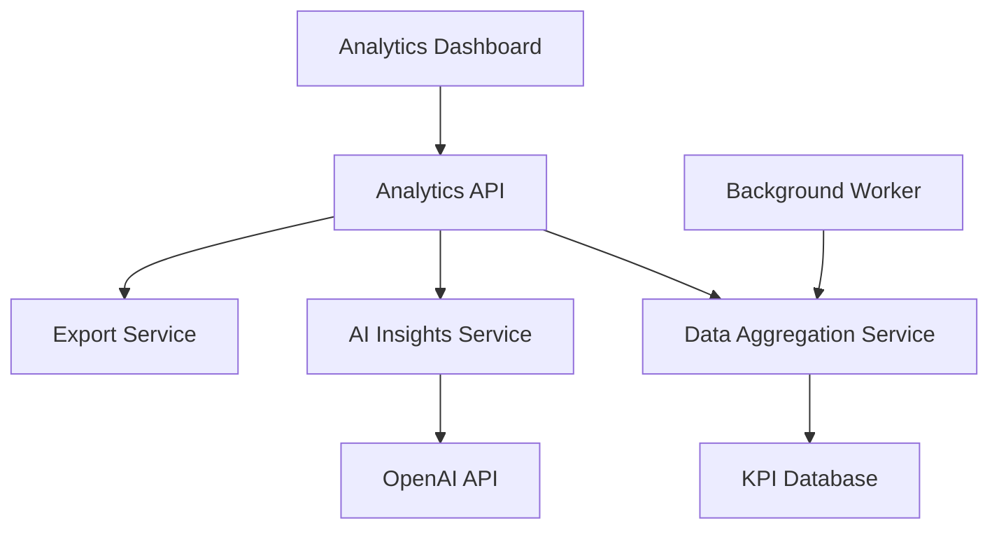

# Design Document

## Overview

The Analytics & Reporting system provides visual insights and trend analysis for KPI data across workspaces. It consists of a dashboard interface, data aggregation services, and AI-powered insight generation to help users understand performance patterns and make strategic decisions.

## Architecture

### High-Level Components



### Data Flow

1. **Data Collection**: Background workers aggregate KPI data hourly
2. **Trend Calculation**: Service calculates moving averages and percentage changes
3. **Insight Generation**: AI service analyzes patterns weekly
4. **Dashboard Rendering**: React components fetch and display processed data
5. **Export Processing**: On-demand generation of CSV/PDF reports

## Components and Interfaces

### Analytics Dashboard Component

```typescript
interface AnalyticsDashboardProps {
  workspaceId: string;
  dateRange: DateRange;
  selectedKpis?: string[];
}

interface AnalyticsData {
  trends: KpiTrend[];
  summary: WorkspaceSummary;
  insights: AiInsight[];
}
```

### Analytics API Endpoints

- `GET /api/analytics/trends` - KPI trend data
- `GET /api/analytics/summary` - Workspace summary metrics
- `GET /api/analytics/insights` - AI-generated insights
- `POST /api/analytics/export` - Generate export files

### Data Aggregation Service

```typescript
interface DataAggregationService {
  aggregateKpiTrends(workspaceId: string, dateRange: DateRange): Promise<KpiTrend[]>;
  calculateSummary(workspaceId: string): Promise<WorkspaceSummary>;
  scheduleAggregation(): void;
}
```

## Data Models

### KPI Trend

```typescript
interface KpiTrend {
  kpiId: string;
  kpiName: string;
  dataPoints: {
    date: Date;
    value: number;
    target?: number;
  }[];
  percentageChange: number;
  trend: 'up' | 'down' | 'stable';
}
```

### Workspace Summary

```typescript
interface WorkspaceSummary {
  totalKpis: number;
  activeGoals: number;
  completionRate: number;
  periodChange: number;
  healthScore: number;
}
```

### AI Insight

```typescript
interface AiInsight {
  id: string;
  type: 'trend' | 'recommendation' | 'alert';
  title: string;
  description: string;
  confidence: number;
  createdAt: Date;
  relatedKpis: string[];
}
```

## Error Handling

### Client-Side Errors
- Loading states for all async operations
- Graceful fallbacks for missing data
- User-friendly error messages
- Retry mechanisms for failed requests

### Server-Side Errors
- Input validation for all API endpoints
- Database connection error handling
- AI service timeout handling
- Export generation failure recovery

### Data Quality Issues
- Handle missing KPI data points
- Validate date ranges
- Sanitize user inputs
- Prevent division by zero in calculations

## Testing Strategy

### Unit Tests
- Data aggregation logic
- Trend calculation algorithms
- AI insight parsing
- Export generation functions

### Integration Tests
- API endpoint responses
- Database query performance
- AI service integration
- Export file generation

### End-to-End Tests
- Dashboard loading and interaction
- Chart rendering with real data
- Export functionality
- Error state handling

### Performance Tests
- Large dataset handling
- Chart rendering performance
- Export generation time
- API response times