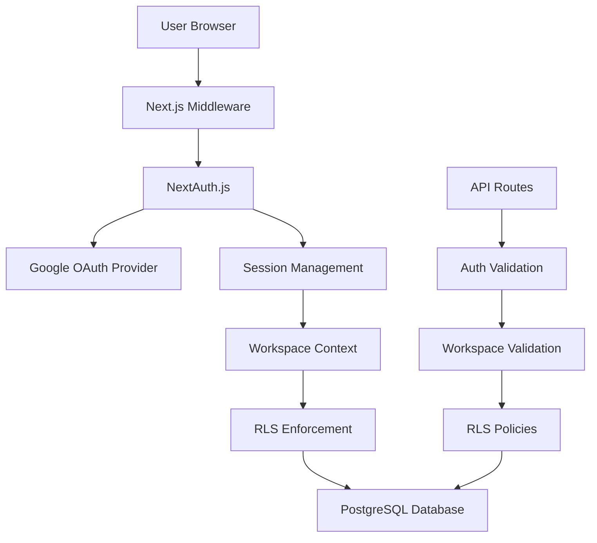
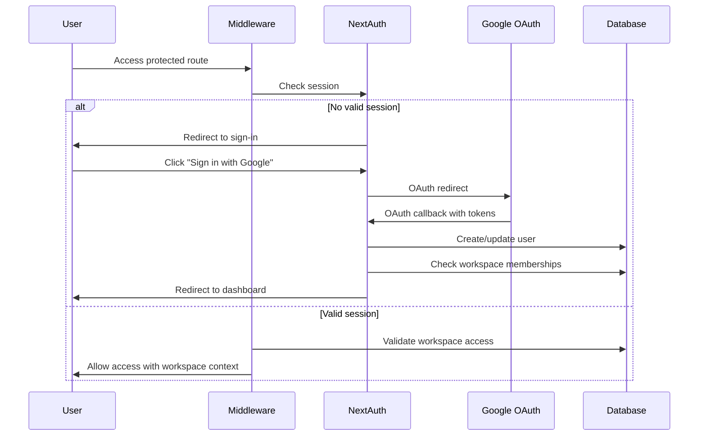

# Authentication System Design

## Overview

The authentication system for Sesari implements a secure, multi-tenant architecture using NextAuth.js with Google OAuth, Prisma with PostgreSQL, and Row-Level Security (RLS) for data isolation. The system provides workspace-based access control with role-based permissions, ensuring that users can only access data within their authorized workspaces.

## Architecture

### High-Level Architecture



### Authentication Flow



## Components and Interfaces

### Core Authentication Components

#### 1. NextAuth Configuration (`lib/auth/config.ts`)
```typescript
interface AuthConfig {
  providers: [GoogleProvider];
  adapter: PrismaAdapter;
  session: {
    strategy: "jwt";
    maxAge: 30 * 24 * 60 * 60; // 30 days
  };
  callbacks: {
    jwt: JWTCallback;
    session: SessionCallback;
    signIn: SignInCallback;
  };
}
```

#### 2. Session Management (`lib/auth/session.ts`)
```typescript
interface ExtendedSession extends Session {
  user: {
    id: string;
    email: string;
    name: string;
    image?: string;
  };
  workspaceId?: string;
  role?: WorkspaceRole;
}

interface WorkspaceContext {
  workspaceId: string;
  role: WorkspaceRole;
  permissions: Permission[];
}
```

#### 3. Middleware Protection (`middleware.ts`)
```typescript
interface MiddlewareConfig {
  matcher: string[];
  protectedRoutes: string[];
  publicRoutes: string[];
  authRoutes: string[];
}
```

### Database Schema

#### User Management Tables
```sql
-- Users table (managed by NextAuth)
CREATE TABLE users (
  id TEXT PRIMARY KEY,
  email TEXT UNIQUE NOT NULL,
  name TEXT,
  image TEXT,
  email_verified TIMESTAMPTZ,
  created_at TIMESTAMPTZ DEFAULT NOW(),
  updated_at TIMESTAMPTZ DEFAULT NOW()
);

-- Workspaces table
CREATE TABLE workspaces (
  id UUID PRIMARY KEY DEFAULT gen_random_uuid(),
  name TEXT NOT NULL,
  slug TEXT UNIQUE NOT NULL,
  owner_id TEXT NOT NULL REFERENCES users(id),
  plan_type TEXT NOT NULL DEFAULT 'free',
  created_at TIMESTAMPTZ DEFAULT NOW(),
  updated_at TIMESTAMPTZ DEFAULT NOW()
);

-- Workspace memberships with roles
CREATE TABLE workspace_memberships (
  id UUID PRIMARY KEY DEFAULT gen_random_uuid(),
  workspace_id UUID NOT NULL REFERENCES workspaces(id) ON DELETE CASCADE,
  user_id TEXT NOT NULL REFERENCES users(id) ON DELETE CASCADE,
  role TEXT NOT NULL CHECK (role IN ('owner', 'admin', 'member')),
  invited_by TEXT REFERENCES users(id),
  invited_at TIMESTAMPTZ,
  joined_at TIMESTAMPTZ DEFAULT NOW(),
  created_at TIMESTAMPTZ DEFAULT NOW(),
  UNIQUE(workspace_id, user_id)
);
```

#### Row-Level Security Policies
```sql
-- Enable RLS on all workspace-related tables
ALTER TABLE workspaces ENABLE ROW LEVEL SECURITY;
ALTER TABLE workspace_memberships ENABLE ROW LEVEL SECURITY;
ALTER TABLE kpis ENABLE ROW LEVEL SECURITY;
ALTER TABLE objectives ENABLE ROW LEVEL SECURITY;

-- Workspace access policy
CREATE POLICY workspace_access ON workspaces
  FOR ALL USING (
    id IN (
      SELECT workspace_id FROM workspace_memberships 
      WHERE user_id = auth.user_id()
    )
  );

-- Workspace membership policy
CREATE POLICY membership_access ON workspace_memberships
  FOR ALL USING (
    workspace_id IN (
      SELECT workspace_id FROM workspace_memberships 
      WHERE user_id = auth.user_id()
    )
  );
```

### Role-Based Access Control

#### Permission System
```typescript
enum WorkspaceRole {
  OWNER = 'owner',
  ADMIN = 'admin', 
  MEMBER = 'member'
}

enum Permission {
  // Workspace management
  MANAGE_WORKSPACE = 'manage_workspace',
  INVITE_MEMBERS = 'invite_members',
  MANAGE_BILLING = 'manage_billing',
  
  // KPI management
  CREATE_KPI = 'create_kpi',
  EDIT_KPI = 'edit_kpi',
  DELETE_KPI = 'delete_kpi',
  VIEW_KPI = 'view_kpi',
  
  // Objective management
  CREATE_OBJECTIVE = 'create_objective',
  EDIT_OBJECTIVE = 'edit_objective',
  DELETE_OBJECTIVE = 'delete_objective',
  VIEW_OBJECTIVE = 'view_objective'
}

const ROLE_PERMISSIONS: Record<WorkspaceRole, Permission[]> = {
  [WorkspaceRole.OWNER]: [
    Permission.MANAGE_WORKSPACE,
    Permission.INVITE_MEMBERS,
    Permission.MANAGE_BILLING,
    Permission.CREATE_KPI,
    Permission.EDIT_KPI,
    Permission.DELETE_KPI,
    Permission.VIEW_KPI,
    Permission.CREATE_OBJECTIVE,
    Permission.EDIT_OBJECTIVE,
    Permission.DELETE_OBJECTIVE,
    Permission.VIEW_OBJECTIVE
  ],
  [WorkspaceRole.ADMIN]: [
    Permission.INVITE_MEMBERS,
    Permission.CREATE_KPI,
    Permission.EDIT_KPI,
    Permission.DELETE_KPI,
    Permission.VIEW_KPI,
    Permission.CREATE_OBJECTIVE,
    Permission.EDIT_OBJECTIVE,
    Permission.DELETE_OBJECTIVE,
    Permission.VIEW_OBJECTIVE
  ],
  [WorkspaceRole.MEMBER]: [
    Permission.VIEW_KPI,
    Permission.VIEW_OBJECTIVE
  ]
};
```

## Data Models

### Authentication Models
```typescript
// Extended user model
interface User {
  id: string;
  email: string;
  name: string;
  image?: string;
  emailVerified?: Date;
  workspaceMemberships: WorkspaceMembership[];
  createdAt: Date;
  updatedAt: Date;
}

// Workspace model
interface Workspace {
  id: string;
  name: string;
  slug: string;
  ownerId: string;
  planType: 'free' | 'starter' | 'pro';
  owner: User;
  memberships: WorkspaceMembership[];
  createdAt: Date;
  updatedAt: Date;
}

// Workspace membership model
interface WorkspaceMembership {
  id: string;
  workspaceId: string;
  userId: string;
  role: WorkspaceRole;
  invitedBy?: string;
  invitedAt?: Date;
  joinedAt: Date;
  workspace: Workspace;
  user: User;
  inviter?: User;
}
```

### Context Models
```typescript
// Workspace context for UI state
interface WorkspaceContextState {
  currentWorkspace: Workspace | null;
  availableWorkspaces: Workspace[];
  userRole: WorkspaceRole | null;
  permissions: Permission[];
  isLoading: boolean;
  switchWorkspace: (workspaceId: string) => Promise<void>;
  refreshWorkspaces: () => Promise<void>;
}
```

## Error Handling

### Authentication Error Types
```typescript
enum AuthError {
  INVALID_CREDENTIALS = 'invalid_credentials',
  SESSION_EXPIRED = 'session_expired',
  WORKSPACE_ACCESS_DENIED = 'workspace_access_denied',
  INSUFFICIENT_PERMISSIONS = 'insufficient_permissions',
  OAUTH_ERROR = 'oauth_error',
  NETWORK_ERROR = 'network_error'
}

interface AuthErrorResponse {
  error: AuthError;
  message: string;
  details?: Record<string, any>;
  retryable: boolean;
}
```

### Error Handling Strategy
- **OAuth Failures**: Display user-friendly messages with retry options
- **Session Expiry**: Automatic redirect to sign-in with return URL preservation
- **Permission Denied**: Clear messaging about required permissions and role
- **Network Issues**: Retry mechanisms with exponential backoff
- **RLS Violations**: Logged as security events, user sees generic access denied

## Testing Strategy

### Unit Tests
```typescript
// Authentication utilities
describe('Auth Utils', () => {
  it('should validate workspace access correctly');
  it('should check permissions based on role');
  it('should handle session expiry gracefully');
});

// RLS enforcement
describe('RLS Policies', () => {
  it('should isolate data between workspaces');
  it('should enforce role-based access');
  it('should prevent unauthorized data access');
});
```

### Integration Tests
```typescript
// Authentication flow
describe('Auth Flow', () => {
  it('should complete Google OAuth successfully');
  it('should create user and workspace on first sign-in');
  it('should handle workspace switching');
  it('should enforce middleware protection');
});

// API endpoint security
describe('API Security', () => {
  it('should validate authentication on protected routes');
  it('should enforce workspace access validation');
  it('should return appropriate error codes');
});
```

### End-to-End Tests
- Complete sign-in flow with Google OAuth
- Workspace creation and member invitation
- Role-based access control verification
- Session persistence across browser restarts
- Multi-workspace switching functionality

## Security Considerations

### Data Protection
- **Encryption**: All sensitive data encrypted at rest and in transit
- **Token Security**: JWT tokens with appropriate expiration and rotation
- **Session Management**: Secure session storage with HttpOnly cookies
- **CSRF Protection**: Built-in NextAuth CSRF protection enabled

### Multi-Tenant Security
- **RLS Enforcement**: Database-level isolation prevents data leakage
- **Workspace Validation**: Double validation at middleware and API levels
- **Audit Logging**: All workspace access attempts logged for security monitoring
- **Permission Checks**: Runtime permission validation for all operations

### OAuth Security
- **PKCE**: Proof Key for Code Exchange enabled for OAuth flows
- **State Validation**: Anti-CSRF state parameter validation
- **Scope Limitation**: Minimal required scopes from Google OAuth
- **Token Refresh**: Automatic token refresh with secure storage

This design provides a robust, secure, and scalable authentication system that meets all the requirements while following security best practices for multi-tenant SaaS applications.