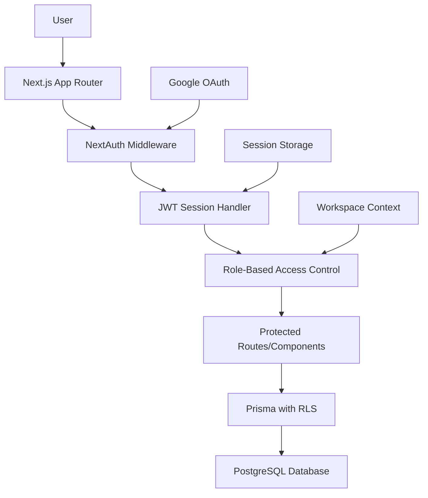
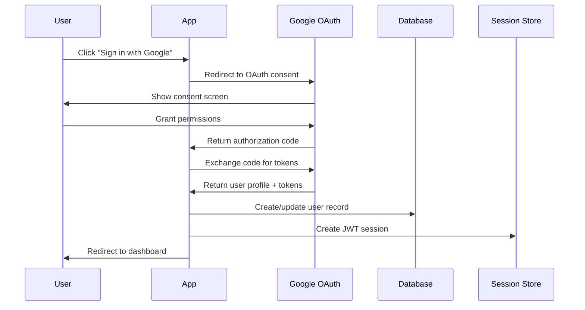

# Design Document

## Overview

The authentication and access control system for Sesari implements a secure, multi-tenant architecture using NextAuth.js with Google OAuth, JWT-based sessions, and Row-Level Security (RLS) enforcement. The design prioritizes security, scalability, and developer experience while maintaining the existing Next.js 15 App Router architecture.

## Architecture

### High-Level Architecture



### Authentication Flow



## Components and Interfaces

### Core Authentication Components

#### 1. NextAuth Configuration (`/src/lib/auth.ts`)

```typescript
interface AuthConfig {
  providers: Provider[];
  adapter: PrismaAdapter;
  session: {
    strategy: 'jwt';
    maxAge: number;
  };
  callbacks: {
    jwt: JWTCallback;
    session: SessionCallback;
  };
}

interface ExtendedJWT {
  userId: string;
  workspaceId: string;
  role: UserRole;
  plan: PlanType;
  email: string;
}

interface ExtendedSession {
  user: {
    id: string;
    email: string;
    name: string;
    image: string;
  };
  workspace: {
    id: string;
    name: string;
    plan: PlanType;
  };
  role: UserRole;
}
```

#### 2. Session Helpers (`/src/lib/auth/session.ts`)

```typescript
interface SessionHelpers {
  getServerSession(): Promise<ExtendedSession | null>;
  requireAuth(): Promise<ExtendedSession>;
  requireRole(roles: UserRole[]): Promise<ExtendedSession>;
  requireWorkspace(workspaceId: string): Promise<ExtendedSession>;
}

enum PlanType {
  FREE = 'FREE',
  STARTER = 'STARTER',
  PRO = 'PRO'
}

enum UserRole {
  SUPERADMIN = 'SUPERADMIN',
  WORKSPACE_ADMIN = 'WORKSPACE_ADMIN',
  EDITOR = 'EDITOR',
  VIEWER = 'VIEWER'
}
```

### Role Definitions and Permissions

| Role | Description | Permissions | RLS Behavior |
|------|--------------|--------------|---------------|
| **SUPERADMIN** | Internal operator or system account | Full system visibility, can impersonate users, manage global settings | ❌ Bypasses RLS **only** via admin service account with `service_key` |
| **WORKSPACE_ADMIN** | Workspace owner | Manage integrations, invite/remove users, create/edit goals, view analytics, billing management | ✅ Scoped to their workspace |
| **EDITOR** | Team collaborator | Create/edit goals, update KPI mappings, access analytics | ✅ Scoped to their workspace |
| **VIEWER** | Read-only member | View dashboards and reports only | ✅ Scoped to their workspace |

> **Security Note:**  
> - SUPERADMIN bypass is disallowed on runtime API routes — restricted to server-side “Admin Tasks” under `/api/admin/*`.
> - All other roles must operate under enforced RLS via `PostgreSQL policies`.
> - If a user has no assigned role, the system defaults to VIEWER (most restrictive) permissions.

---

## 4. Role Enforcement in UI

| UI Component | Visible To | Notes |
|---------------|-------------|-------|
| “Manage Users” | WORKSPACE_ADMIN, SUPERADMIN | Disabled for lower roles |
| “Add Integration” | WORKSPACE_ADMIN | Hidden otherwise |
| “Edit Goal” Button | EDITOR, WORKSPACE_ADMIN | Disabled for VIEWER |
| “Strategy Canvas” | All roles | Read-only for VIEWER |
| “Billing Settings” | WORKSPACE_ADMIN | Locked for all others |


#### 3. Middleware (`/src/middleware.ts`)

To address Requirement 6 (middleware-based route protection), the system implements comprehensive route protection:

```typescript
interface MiddlewareConfig {
  matcher: string[];
  publicRoutes: string[];
  authRoutes: string[];
  protectedRoutes: string[];
  apiRoutes: string[];
}

interface AuthMiddleware {
  validateSession(request: NextRequest): Promise<boolean>;
  redirectToSignIn(request: NextRequest): NextResponse;
  injectSessionContext(request: NextRequest): NextRequest;
  checkRoutePermissions(request: NextRequest, session: ExtendedSession): boolean;
  handleAuthError(request: NextRequest, error: AuthError): NextResponse;
}

// Route protection configuration
const routeConfig = {
  publicRoutes: ['/signin', '/signup', '/about', '/pricing'],
  protectedRoutes: ['/dashboard', '/kpis', '/goals', '/settings'],
  apiRoutes: ['/api/kpis', '/api/goals', '/api/integrations'],
  roleBasedRoutes: {
    '/admin': ['SUPERADMIN'],
    '/settings/workspace': ['SUPERADMIN', 'WORKSPACE_ADMIN'],
    '/api/admin': ['SUPERADMIN']
  }
};
```

**Design Rationale:**
- **Fail-Secure**: Middleware denies access by default, requiring explicit route configuration
- **Consistent Application**: All routes automatically protected unless explicitly marked public
- **Context Injection**: Session context made available to all route handlers
- **Role-Based Protection**: Specific routes can require specific roles
- **API Route Protection**: Both page and API routes protected by same middleware
```

#### 4. RLS Enforcement (`/src/lib/db/rls.ts`)

```typescript
interface RLSContext {
  userId: string;
  workspaceId: string;
  role: UserRole;
}

interface RLSPrismaClient {
  withRLS(context: RLSContext): PrismaClient;
  bypassRLS(): PrismaClient; // Superadmin only
}
```

### Component Integration

#### Protected Route Component

```typescript
interface ProtectedRouteProps {
  children: React.ReactNode;
  requiredRoles?: UserRole[];
  fallback?: React.ReactNode;
}

function ProtectedRoute({ children, requiredRoles, fallback }: ProtectedRouteProps) {
  // Implementation handles role-based rendering
}
```

#### Auth Provider Context

```typescript
interface AuthContextValue {
  session: ExtendedSession | null;
  loading: boolean;
  signIn: () => Promise<void>;
  signOut: () => Promise<void>;
  hasRole: (roles: UserRole[]) => boolean;
  canAccessWorkspace: (workspaceId: string) => boolean;
}
```

#### Session Persistence Strategy

To address Requirement 5 (persistent authentication across browser sessions), the system implements:

```typescript
interface SessionPersistence {
  // JWT tokens stored in HttpOnly cookies for security
  accessToken: {
    name: 'next-auth.session-token';
    httpOnly: true;
    secure: true;
    sameSite: 'lax';
    maxAge: 900; // 15 minutes
  };
  
  refreshToken: {
    name: 'next-auth.refresh-token';
    httpOnly: true;
    secure: true;
    sameSite: 'lax';
    maxAge: 2592000; // 30 days
  };
  
  // Automatic token refresh mechanism
  refreshThreshold: 300; // Refresh when 5 minutes remaining
  backgroundRefresh: boolean; // Refresh in background
  
  // Session invalidation capabilities
  globalSignOut: () => Promise<void>; // Invalidate all user sessions
  securityBreach: () => Promise<void>; // Emergency session invalidation
}
```

**Design Rationale:**
- **HttpOnly Cookies**: Prevents XSS attacks by making tokens inaccessible to JavaScript
- **Short Access Tokens**: 15-minute expiry reduces exposure window
- **Long Refresh Tokens**: 30-day expiry balances security with user experience
- **Background Refresh**: Seamless token renewal without user interruption
- **Emergency Invalidation**: Supports security breach response procedures

## Data Models

### User Model Extensions

```typescript
model User {
  id          String   @id @default(cuid())
  email       String   @unique
  name        String?
  image       String?
  createdAt   DateTime @default(now())
  updatedAt   DateTime @updatedAt
  
  // Workspace relationships
  workspaces  UserWorkspace[]
  
  // OAuth fields
  accounts    Account[]
  sessions    Session[]
}

model UserWorkspace {
  id          String    @id @default(cuid())
  userId      String
  workspaceId String
  role        UserRole  @default(VIEWER)
  isPrimary   Boolean   @default(false)
  createdAt   DateTime  @default(now())
  
  user        User      @relation(fields: [userId], references: [id], onDelete: Cascade)
  workspace   Workspace @relation(fields: [workspaceId], references: [id], onDelete: Cascade)
  
  @@unique([userId, workspaceId])
}

model Workspace {
  id          String    @id @default(cuid())
  name        String
  plan        PlanType  @default(FREE)
  createdAt   DateTime  @default(now())
  updatedAt   DateTime  @updatedAt
  
  users       UserWorkspace[]
  kpis        KPI[]
  goals       Goal[]
  
  @@map("workspaces")
}
```

### RLS Policies

```sql
-- Enable RLS on all tenant tables
ALTER TABLE workspaces ENABLE ROW LEVEL SECURITY;
ALTER TABLE kpis ENABLE ROW LEVEL SECURITY;
ALTER TABLE goals ENABLE ROW LEVEL SECURITY;

-- Workspace access policy
CREATE POLICY workspace_access ON workspaces
  FOR ALL TO authenticated
  USING (
    id IN (
      SELECT workspace_id FROM user_workspaces 
      WHERE user_id = auth.uid()
    )
  );

-- KPI access policy
CREATE POLICY kpi_workspace_access ON kpis
  FOR ALL TO authenticated
  USING (
    workspace_id IN (
      SELECT workspace_id FROM user_workspaces 
      WHERE user_id = auth.uid()
    )
  );
```

## Error Handling

### Authentication Errors

```typescript
enum AuthError {
  OAUTH_CALLBACK_ERROR = 'OAUTH_CALLBACK_ERROR',
  SESSION_EXPIRED = 'SESSION_EXPIRED',
  INSUFFICIENT_PERMISSIONS = 'INSUFFICIENT_PERMISSIONS',
  WORKSPACE_ACCESS_DENIED = 'WORKSPACE_ACCESS_DENIED',
  RLS_VIOLATION = 'RLS_VIOLATION'
}

interface AuthErrorHandler {
  handleOAuthError(error: OAuthError): NextResponse;
  handleSessionError(error: SessionError): NextResponse;
  handlePermissionError(error: PermissionError): NextResponse;
}
```

### Error Recovery Strategies

1. **OAuth Failures**: Retry mechanism with exponential backoff
2. **Session Expiry**: Automatic token refresh with fallback to re-authentication
3. **Permission Denied**: Graceful degradation with appropriate UI feedback
4. **RLS Violations**: Security logging and user notification

## Testing Strategy

### Unit Tests (Vitest)

```typescript
// Session callback tests
describe('JWT Callback', () => {
  it('should augment JWT with workspace context');
  it('should handle missing workspace gracefully');
  it('should validate role assignments');
});

// Session helper tests
describe('Session Helpers', () => {
  it('should require authentication for protected functions');
  it('should validate role-based access');
  it('should enforce workspace isolation');
});

// RLS tests
describe('RLS Enforcement', () => {
  it('should apply workspace filters automatically');
  it('should prevent cross-workspace data access');
  it('should allow superadmin bypass with audit');
});
```

### Integration Tests (Playwright)

```typescript
// End-to-end authentication flow
test('Google OAuth Sign-in Flow', async ({ page }) => {
  // Test complete OAuth flow from sign-in to dashboard
});

test('Role-based Access Control', async ({ page }) => {
  // Test different user roles accessing appropriate features
});

test('Workspace Isolation', async ({ page }) => {
  // Test that users can only access their workspace data
});
```

### Security Tests

```typescript
// JWT manipulation tests
test('JWT Token Security', () => {
  // Test token tampering detection
  // Test token expiry handling
  // Test refresh token rotation
});

// RLS bypass attempts
test('RLS Security', () => {
  // Test direct database access attempts
  // Test workspace ID manipulation
  // Test privilege escalation attempts
});
```

## Performance Considerations

### Session Management

- **JWT Strategy**: Stateless tokens reduce database load
- **Token Caching**: In-memory caching for frequently accessed sessions
- **Lazy Loading**: Workspace context loaded only when needed

### Database Optimization

- **RLS Performance**: Indexed workspace_id columns for efficient filtering
- **Connection Pooling**: Optimized Prisma connection management
- **Query Optimization**: Efficient joins for user-workspace relationships

### Caching Strategy

```typescript
interface CacheStrategy {
  sessionCache: {
    ttl: 300; // 5 minutes
    maxSize: 1000;
  };
  workspaceCache: {
    ttl: 900; // 15 minutes
    maxSize: 500;
  };
}
```

## Security Considerations

### JWT Security

- **Short Expiry**: 15-minute access tokens with refresh rotation
- **Secure Storage**: HttpOnly cookies for refresh tokens
- **CSRF Protection**: Built-in NextAuth CSRF protection
- **Token Validation**: Signature verification on every request

### RLS Implementation

- **Defense in Depth**: Multiple layers of access control
- **Audit Logging**: All RLS bypasses logged for security monitoring
- **Fail Secure**: Default deny for ambiguous access scenarios

### OAuth Security

- **PKCE Flow**: Proof Key for Code Exchange for enhanced security
- **State Validation**: CSRF protection during OAuth flow
- **Scope Limitation**: Minimal required Google OAuth scopes

## Deployment Considerations

### Environment Variables

```bash
NEXTAUTH_URL=https://app.sesari.com
NEXTAUTH_SECRET=<secure-random-string>
GOOGLE_CLIENT_ID=<google-oauth-client-id>
GOOGLE_CLIENT_SECRET=<google-oauth-client-secret>
DATABASE_URL=<postgresql-connection-string>
```

### Production Hardening

- **HTTPS Only**: All authentication endpoints require HTTPS
- **Secure Headers**: CSP, HSTS, and other security headers
- **Rate Limiting**: OAuth endpoint rate limiting
- **Monitoring**: Authentication failure monitoring and alerting