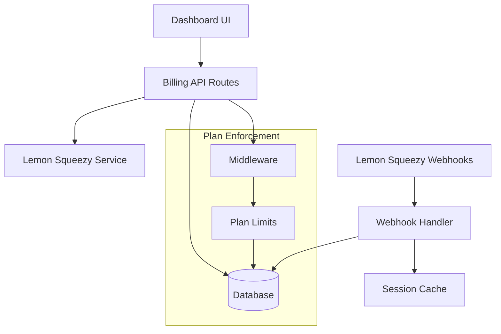

# Design Document

## Overview

The billing system provides subscription management through Lemon Squeezy integration, plan-based feature enforcement, and real-time webhook processing. The architecture follows a multi-tenant approach with plan restrictions enforced at the database and API levels.

## Architecture



## Components and Interfaces

### Core Services

**Lemon Squeezy Service** (`/services/integrations/lemonsqueezy/`)
- `createCheckoutSession(planId, userId)` - Generate checkout URL
- `getSubscription(subscriptionId)` - Fetch subscription details
- `getCustomerPortalUrl(customerId)` - Generate portal access

**Billing Service** (`/lib/billing.ts`)
- `getUserPlan(userId)` - Get current plan with limits
- `canAccessFeature(userId, feature)` - Feature gate validation
- `updateSubscription(webhookData)` - Process subscription changes

### API Routes

**Checkout Route** (`/api/billing/checkout`)
```typescript
POST /api/billing/checkout
Body: { planType: 'starter' | 'pro' }
Response: { checkoutUrl: string }
```

**Webhook Handler** (`/api/billing/webhook`)
```typescript
POST /api/billing/webhook
Headers: { 'x-signature': string }
Body: LemonSqueezyWebhookEvent
Response: { received: true }
```

**Subscription Status** (`/api/billing/subscription`)
```typescript
GET /api/billing/subscription
Response: { 
  plan: PlanType,
  status: 'active' | 'cancelled' | 'expired',
  nextBilling: Date,
  limits: PlanLimits
}
```

## Data Models

### Prisma Schema Extensions

```prisma
enum PlanType {
  FREE
  STARTER
  PRO
}

enum SubscriptionStatus {
  TRIAL
  ACTIVE
  CANCELLED
  EXPIRED
  PAST_DUE
}

model Subscription {
  id                String              @id @default(cuid())
  userId            String              @unique
  user              User                @relation(fields: [userId], references: [id])
  
  planType          PlanType            @default(FREE)
  status            SubscriptionStatus  @default(ACTIVE)
  
  lemonSqueezyId    String?             @unique
  customerId        String?
  
  trialStart        DateTime?
  trialEnd          DateTime?
  currentPeriodStart DateTime?
  currentPeriodEnd   DateTime?
  cancelAtPeriodEnd  Boolean            @default(false)
  
  createdAt         DateTime            @default(now())
  updatedAt         DateTime            @updatedAt
}
```

### Plan Limits Configuration

```typescript
const PLAN_LIMITS = {
  FREE: {
    workspaces: 1,
    kpis: 10,
    integrations: 0,
    aiInsights: false
  },
  STARTER: {
    workspaces: 3,
    kpis: 50,
    integrations: 3,
    aiInsights: true
  },
  PRO: {
    workspaces: 10,
    kpis: 200,
    integrations: 10,
    aiInsights: true
  }
}
```

## Error Handling

### Webhook Processing
- Signature verification failures return 401
- Malformed payloads return 400 with validation errors
- Processing errors are logged and return 500 for retry
- Idempotency handled via event ID tracking

### Payment Failures
- Failed checkouts redirect to billing page with error message
- Expired subscriptions trigger graceful feature downgrade
- Payment method failures show customer portal link

### Feature Enforcement
- Blocked actions show upgrade modal with specific plan benefits
- Soft limits display usage warnings at 80% capacity
- Hard limits prevent action with clear messaging

## Testing Strategy

### Unit Tests
- Plan limit validation logic
- Webhook signature verification
- Subscription status calculations
- Feature gate enforcement

### Integration Tests
- Lemon Squeezy API mocking
- Webhook event processing
- Database subscription updates
- Session invalidation

### E2E Tests
- Complete upgrade flow from free to paid
- Subscription cancellation and downgrade
- Feature access enforcement across plans
- Billing page functionality