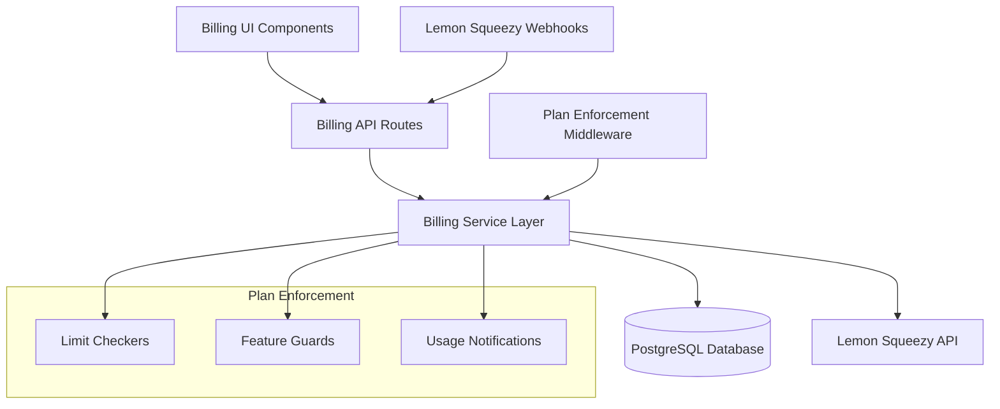

# Billing System Design

## Overview

The billing system integrates with Lemon Squeezy to manage subscription plans (Free, Starter, Pro), enforce feature limits, handle trial periods, and process real-time webhook updates. It provides a comprehensive subscription management layer that controls access to features and resources based on user plan tiers.

## Architecture

### System Components



### Data Flow

1. **Subscription Creation**: User clicks upgrade → Lemon Squeezy checkout → Webhook updates database
2. **Plan Enforcement**: API requests → Middleware checks limits → Allow/deny based on plan
3. **Usage Tracking**: Resource creation → Update usage counters → Check against limits
4. **Trial Management**: Trial expiration job → Downgrade plan → Notify user

## Components and Interfaces

### Database Schema Extensions

```typescript
// New billing-related models
model Subscription {
  id                String    @id @default(uuid())
  userId            String    @map("user_id")
  lemonSqueezyId    String    @unique @map("lemonsqueezy_id")
  planType          PlanType
  status            SubscriptionStatus
  trialEndsAt       DateTime? @map("trial_ends_at")
  currentPeriodEnd  DateTime  @map("current_period_end")
  cancelAtPeriodEnd Boolean   @default(false) @map("cancel_at_period_end")
  createdAt         DateTime  @default(now()) @map("created_at")
  updatedAt         DateTime  @updatedAt @map("updated_at")

  user User @relation(fields: [userId], references: [id], onDelete: Cascade)
  
  @@map("subscriptions")
}

model UsageTracking {
  id          String   @id @default(uuid())
  workspaceId String   @map("workspace_id")
  kpiCount    Int      @default(0) @map("kpi_count")
  updatedAt   DateTime @updatedAt @map("updated_at")

  workspace Workspace @relation(fields: [workspaceId], references: [id], onDelete: Cascade)
  
  @@map("usage_tracking")
}

enum PlanType {
  FREE
  STARTER
  PRO
}

enum SubscriptionStatus {
  ACTIVE
  TRIALING
  PAST_DUE
  CANCELED
  UNPAID
}
```

### Core Service Interfaces

```typescript
interface BillingService {
  // Subscription management
  createCheckoutSession(userId: string, planType: PlanType): Promise<CheckoutSession>;
  getSubscription(userId: string): Promise<Subscription | null>;
  cancelSubscription(userId: string): Promise<void>;
  
  // Plan enforcement
  checkWorkspaceLimit(userId: string): Promise<boolean>;
  checkKpiLimit(workspaceId: string): Promise<boolean>;
  checkFeatureAccess(userId: string, feature: Feature): Promise<boolean>;
  
  // Usage tracking
  incrementKpiCount(workspaceId: string): Promise<void>;
  decrementKpiCount(workspaceId: string): Promise<void>;
  getUsageStats(userId: string): Promise<UsageStats>;
  
  // Trial management
  startTrial(userId: string): Promise<void>;
  checkTrialStatus(userId: string): Promise<TrialStatus>;
  expireTrial(userId: string): Promise<void>;
}

interface WebhookService {
  verifySignature(payload: string, signature: string): boolean;
  processSubscriptionCreated(data: LemonSqueezyWebhookData): Promise<void>;
  processSubscriptionUpdated(data: LemonSqueezyWebhookData): Promise<void>;
  processSubscriptionCanceled(data: LemonSqueezyWebhookData): Promise<void>;
  processPaymentFailed(data: LemonSqueezyWebhookData): Promise<void>;
}

interface PlanEnforcementService {
  enforceLimits(userId: string, action: ResourceAction): Promise<EnforcementResult>;
  getFeatureAccess(userId: string): Promise<FeatureAccess>;
  notifyLimitApproaching(userId: string, limitType: LimitType): Promise<void>;
}
```

### Plan Configuration

```typescript
const PLAN_LIMITS = {
  FREE: {
    workspaces: 1,
    kpisPerWorkspace: 5,
    integrations: false,
    aiFeatures: false,
    trialDays: 0
  },
  STARTER: {
    workspaces: 3,
    kpisPerWorkspace: 15,
    integrations: true,
    aiFeatures: true,
    trialDays: 14
  },
  PRO: {
    workspaces: -1, // unlimited
    kpisPerWorkspace: -1, // unlimited
    integrations: true,
    aiFeatures: true,
    trialDays: 14
  }
} as const;
```

## Data Models

### Subscription Model

```typescript
interface Subscription {
  id: string;
  userId: string;
  lemonSqueezyId: string;
  planType: PlanType;
  status: SubscriptionStatus;
  trialEndsAt?: Date;
  currentPeriodEnd: Date;
  cancelAtPeriodEnd: boolean;
  createdAt: Date;
  updatedAt: Date;
}

interface UsageStats {
  workspaceCount: number;
  workspaceLimit: number;
  kpiCounts: Record<string, number>; // workspaceId -> count
  kpiLimits: Record<string, number>; // workspaceId -> limit
  planType: PlanType;
  trialEndsAt?: Date;
}
```

### Webhook Data Models

```typescript
interface LemonSqueezyWebhookData {
  meta: {
    event_name: string;
    custom_data?: Record<string, any>;
  };
  data: {
    id: string;
    type: string;
    attributes: {
      store_id: number;
      customer_id: number;
      order_id: number;
      product_id: number;
      variant_id: number;
      status: string;
      trial_ends_at?: string;
      renews_at?: string;
      ends_at?: string;
      created_at: string;
      updated_at: string;
    };
  };
}
```

## Error Handling

### Error Types

```typescript
enum BillingError {
  SUBSCRIPTION_NOT_FOUND = 'subscription_not_found',
  PLAN_LIMIT_EXCEEDED = 'plan_limit_exceeded',
  FEATURE_NOT_AVAILABLE = 'feature_not_available',
  WEBHOOK_VERIFICATION_FAILED = 'webhook_verification_failed',
  LEMONSQUEEZY_API_ERROR = 'lemonsqueezy_api_error',
  TRIAL_EXPIRED = 'trial_expired',
  PAYMENT_FAILED = 'payment_failed'
}

interface BillingErrorResponse {
  error: BillingError;
  message: string;
  upgradeRequired?: boolean;
  currentPlan?: PlanType;
  suggestedPlan?: PlanType;
}
```

### Error Recovery Strategies

1. **API Failures**: Implement exponential backoff with circuit breaker pattern
2. **Webhook Processing**: Queue failed webhooks for retry with dead letter queue
3. **Limit Enforcement**: Default to most restrictive limits when plan cannot be determined
4. **Payment Failures**: Provide grace period before downgrading access

## Testing Strategy

### Unit Tests

```typescript
// Core service tests
describe('BillingService', () => {
  it('should enforce workspace limits correctly');
  it('should handle trial expiration properly');
  it('should track usage accurately');
  it('should validate plan upgrades');
});

// Webhook processing tests
describe('WebhookService', () => {
  it('should verify Lemon Squeezy signatures');
  it('should process subscription events correctly');
  it('should handle malformed webhook data');
  it('should retry failed webhook processing');
});

// Plan enforcement tests
describe('PlanEnforcementService', () => {
  it('should block actions when limits exceeded');
  it('should allow actions within limits');
  it('should notify users approaching limits');
  it('should handle feature access correctly');
});
```

### Integration Tests

```typescript
// End-to-end billing flow tests
describe('Billing Integration', () => {
  it('should complete subscription flow from checkout to activation');
  it('should enforce limits after plan changes');
  it('should handle trial-to-paid conversion');
  it('should process cancellation correctly');
});

// Webhook integration tests
describe('Webhook Integration', () => {
  it('should process real Lemon Squeezy webhook payloads');
  it('should maintain data consistency during webhook processing');
  it('should handle webhook replay attacks');
});
```

### Security Testing

1. **Webhook Signature Verification**: Test signature validation with various payloads
2. **Plan Bypass Prevention**: Ensure limits cannot be circumvented
3. **Data Isolation**: Verify billing data is properly isolated between users
4. **Rate Limiting**: Test webhook endpoint against abuse

## Implementation Phases

### Phase 1: Core Infrastructure
- Database schema migration
- Basic subscription model and service
- Plan limit configuration
- Simple plan enforcement middleware

### Phase 2: Lemon Squeezy Integration
- Checkout session creation
- Webhook endpoint and signature verification
- Subscription lifecycle management
- Payment failure handling

### Phase 3: Usage Tracking & Enforcement
- Real-time usage tracking
- Limit enforcement in API routes
- Usage notifications and warnings
- Feature access controls

### Phase 4: Trial Management
- Trial period tracking
- Automated trial expiration
- Trial-to-paid conversion
- Email notifications for trial status

### Phase 5: UI & User Experience
- Billing dashboard components
- Usage visualization
- Upgrade prompts and modals
- Customer portal integration