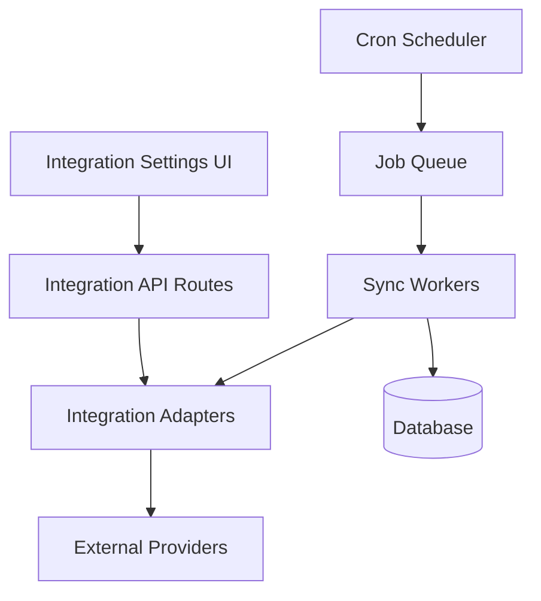

# Design Document

## Overview

The External Integrations system provides a unified framework for connecting third-party services to automatically sync KPI data. The architecture uses a standardized adapter pattern with background job processing for reliable data synchronization.

## Architecture



The system follows a layered architecture:
- **Presentation Layer**: React components for integration management
- **API Layer**: Next.js API routes for CRUD operations
- **Service Layer**: Integration adapters implementing common interface
- **Worker Layer**: Background jobs for data synchronization
- **Data Layer**: Encrypted credential storage and KPI data

## Components and Interfaces

### IntegrationAdapter Interface

```typescript
interface IntegrationAdapter {
  connect(credentials: ConnectionCredentials): Promise<ConnectionResult>
  sync(): Promise<SyncResult>
  healthCheck(): Promise<HealthStatus>
  disconnect(): Promise<void>
}

interface ConnectionCredentials {
  provider: string
  accessToken: string
  refreshToken?: string
  expiresAt?: Date
}

interface SyncResult {
  success: boolean
  recordsProcessed: number
  errors: SyncError[]
  nextSyncAt: Date
}
```

### Provider Adapters

**Google Analytics Adapter** (`/services/integrations/google/analytics.ts`)
- OAuth 2.0 flow implementation
- GA4 Reporting API integration
- Metric transformation to KPI format
- Rate limiting and error handling

**Meta Ads Adapter** (`/services/integrations/meta/ads.ts`)
- Facebook Marketing API integration
- Campaign and ad set data retrieval
- ROAS and spend metric calculation
- Webhook support for real-time updates

**Resend Adapter** (`/services/integrations/resend/email.ts`)
- Email template management
- Batch sending capabilities
- Delivery status tracking
- Bounce and complaint handling

## Data Models

### Integration Configuration

```typescript
interface Integration {
  id: string
  workspaceId: string
  provider: 'google_analytics' | 'meta_ads' | 'resend'
  status: 'connected' | 'disconnected' | 'error'
  credentials: EncryptedCredentials
  settings: ProviderSettings
  lastSyncAt?: Date
  createdAt: Date
  updatedAt: Date
}
```

### Sync Job Schema

```typescript
interface SyncJob {
  id: string
  integrationId: string
  status: 'pending' | 'running' | 'completed' | 'failed'
  startedAt?: Date
  completedAt?: Date
  error?: string
  retryCount: number
  nextRetryAt?: Date
}
```

## Error Handling

### Error Categories
- **Authentication Errors**: Invalid tokens, expired credentials
- **API Errors**: Rate limits, service unavailable, invalid requests
- **Data Errors**: Malformed responses, missing required fields
- **System Errors**: Database failures, network timeouts

### Retry Strategy
- Exponential backoff: 1min, 2min, 4min, 8min, 16min
- Maximum 5 retry attempts per sync job
- Dead letter queue for permanently failed jobs
- Admin notifications for repeated failures

### Graceful Degradation
- Continue syncing other integrations if one fails
- Cache last successful data for display during outages
- Provide manual sync option for critical integrations

## Testing Strategy

### Unit Tests
- Mock all external API calls using MSW
- Test adapter interface compliance
- Validate error handling and retry logic
- Coverage target: 80% for integration code

### Integration Tests
- Test OAuth flows with provider sandboxes
- Validate data transformation accuracy
- Test webhook handling and processing
- End-to-end sync job execution

### Load Testing
- Simulate high-volume data sync scenarios
- Test rate limiting and backoff behavior
- Validate worker queue performance under load