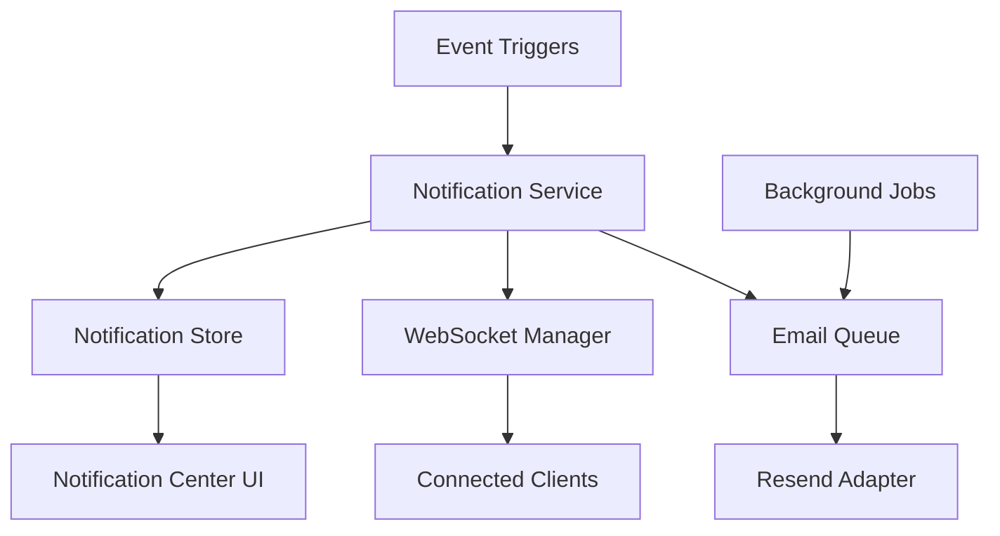

# Design Document

## Overview

The notifications system provides a multi-channel communication platform supporting email delivery via Resend and real-time in-app notifications through WebSocket connections. The architecture follows a pub-sub pattern with background job processing for reliable delivery and a React-based notification center for user interaction.

## Architecture



The system uses a centralized notification service that routes messages to appropriate channels based on user preferences and notification type. Background jobs handle email delivery with retry logic, while WebSocket connections provide real-time updates.

## Components and Interfaces

### Core Service Layer
- **NotificationService**: Central orchestrator for all notification operations
- **EmailAdapter**: Resend integration for email delivery with template management
- **WebSocketManager**: Real-time connection handling and message broadcasting
- **NotificationQueue**: Background job processing with retry mechanisms

### Data Layer
- **NotificationRepository**: Database operations with RLS enforcement
- **UserPreferencesRepository**: Notification settings management
- **DeliveryLogRepository**: Tracking and monitoring notification delivery

### UI Components
- **NotificationCenter**: Dropdown panel showing recent notifications
- **NotificationBell**: Header icon with unread count badge
- **NotificationSettings**: User preference management interface
- **NotificationItem**: Individual notification display component

## Data Models

### Notification Model
```typescript
interface Notification {
  id: string
  workspace_id: string
  user_id: string
  type: 'billing' | 'kpi_sync' | 'ai_insight' | 'workspace_update'
  title: string
  message: string
  metadata?: Record<string, any>
  read_at?: Date
  created_at: Date
}
```

### User Preferences Model
```typescript
interface NotificationPreferences {
  user_id: string
  email_billing: boolean
  email_kpi_updates: boolean
  email_ai_insights: boolean
  in_app_enabled: boolean
  updated_at: Date
}
```

### Delivery Log Model
```typescript
interface DeliveryLog {
  id: string
  notification_id: string
  channel: 'email' | 'websocket'
  status: 'pending' | 'sent' | 'failed' | 'retrying'
  attempts: number
  last_attempt_at?: Date
  delivered_at?: Date
  error_message?: string
}
```

## Error Handling

### Email Delivery Failures
- Implement exponential backoff retry strategy (1min, 5min, 15min)
- Log all delivery attempts with error details
- Mark notifications as permanently failed after 3 attempts
- Provide admin dashboard for monitoring failed deliveries

### WebSocket Connection Issues
- Automatic reconnection with exponential backoff
- Queue notifications during disconnection periods
- Fallback to polling for critical notifications
- Graceful degradation when WebSocket unavailable

### Database Failures
- Transaction rollback for notification creation failures
- Retry logic for temporary database connectivity issues
- Circuit breaker pattern for persistent database problems
- Fallback to in-memory queuing during outages

## Testing Strategy

### Unit Testing
- Mock Resend API calls for email adapter testing
- Test notification routing logic with various user preferences
- Validate WebSocket message formatting and delivery
- Test retry mechanisms with simulated failures

### Integration Testing
- End-to-end email delivery with Resend test environment
- WebSocket connection lifecycle testing
- Database transaction testing with RLS validation
- Background job processing with queue management

### Performance Testing
- Load testing WebSocket connections (1000+ concurrent users)
- Email delivery throughput testing
- Database query performance with large notification volumes
- Memory usage testing for notification queuing