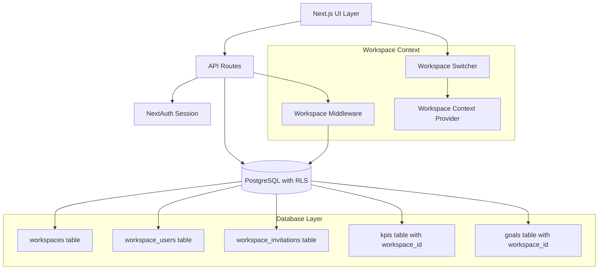

# Workspace Management Design Document

## Overview

The workspace management system provides multi-tenant functionality for Sesari, allowing users to create and manage separate workspaces for different teams, products, or business units. Each workspace maintains complete data isolation using PostgreSQL Row-Level Security (RLS) policies, ensuring users can only access data from workspaces they belong to.

The system supports role-based access control with three primary roles: Owner (full control), Admin (management permissions), and Member (read/write access to workspace data). Workspace switching is seamless through a context-aware navigation system that preserves user experience while maintaining strict security boundaries.

## Architecture

### High-Level Architecture



### Data Flow

1. **Authentication**: User authenticates via NextAuth (Google OAuth)
2. **Workspace Resolution**: Middleware determines current workspace from URL or session
3. **Authorization**: RLS policies filter data based on workspace membership
4. **Context Propagation**: Workspace context flows through React components
5. **Data Access**: All queries automatically scoped to accessible workspaces

## Components and Interfaces

### Core Components

#### WorkspaceProvider
```typescript
interface WorkspaceContextType {
  currentWorkspace: Workspace | null;
  availableWorkspaces: Workspace[];
  switchWorkspace: (workspaceId: string) => Promise<void>;
  isLoading: boolean;
  error: string | null;
}

export function WorkspaceProvider({ children }: { children: React.ReactNode }) {
  // Manages workspace state and switching logic
}
```

#### WorkspaceSwitcher
```typescript
interface WorkspaceSwitcherProps {
  className?: string;
  showCreateButton?: boolean;
}

export function WorkspaceSwitcher({ className, showCreateButton }: WorkspaceSwitcherProps) {
  // Dropdown component for workspace selection
  // Integrates with existing Sidebar component
}
```

#### WorkspaceSettings
```typescript
interface WorkspaceSettingsProps {
  workspace: Workspace;
  userRole: WorkspaceRole;
}

export function WorkspaceSettings({ workspace, userRole }: WorkspaceSettingsProps) {
  // Workspace management interface
  // Member management, invitations, settings
}
```

#### InvitationManager
```typescript
interface InvitationManagerProps {
  workspaceId: string;
  canManageInvitations: boolean;
}

export function InvitationManager({ workspaceId, canManageInvitations }: InvitationManagerProps) {
  // Send, view, and manage workspace invitations
}
```

### API Interfaces

#### Workspace API Routes
```typescript
// /api/workspaces
GET    /api/workspaces              // List user's workspaces
POST   /api/workspaces              // Create new workspace
GET    /api/workspaces/[id]         // Get workspace details
PUT    /api/workspaces/[id]         // Update workspace
DELETE /api/workspaces/[id]         // Delete workspace (owner only)

// /api/workspaces/[id]/members
GET    /api/workspaces/[id]/members    // List workspace members
PUT    /api/workspaces/[id]/members/[userId]  // Update member role
DELETE /api/workspaces/[id]/members/[userId]  // Remove member

// /api/workspaces/[id]/invitations
GET    /api/workspaces/[id]/invitations       // List pending invitations
POST   /api/workspaces/[id]/invitations       // Send invitation
DELETE /api/workspaces/[id]/invitations/[id]  // Cancel invitation

// /api/invitations
GET    /api/invitations/[token]     // Get invitation details
POST   /api/invitations/[token]/accept  // Accept invitation
POST   /api/invitations/[token]/decline // Decline invitation
```

## Data Models

### Database Schema

```sql
-- Workspaces table
CREATE TABLE workspaces (
  id UUID PRIMARY KEY DEFAULT gen_random_uuid(),
  name VARCHAR(255) NOT NULL,
  slug VARCHAR(100) UNIQUE NOT NULL,
  description TEXT,
  created_at TIMESTAMP WITH TIME ZONE DEFAULT NOW(),
  updated_at TIMESTAMP WITH TIME ZONE DEFAULT NOW()
);

-- Workspace users (membership)
CREATE TABLE workspace_users (
  id UUID PRIMARY KEY DEFAULT gen_random_uuid(),
  workspace_id UUID NOT NULL REFERENCES workspaces(id) ON DELETE CASCADE,
  user_id VARCHAR(255) NOT NULL, -- NextAuth user ID
  role workspace_role NOT NULL DEFAULT 'member',
  joined_at TIMESTAMP WITH TIME ZONE DEFAULT NOW(),
  UNIQUE(workspace_id, user_id)
);

-- Workspace invitations
CREATE TABLE workspace_invitations (
  id UUID PRIMARY KEY DEFAULT gen_random_uuid(),
  workspace_id UUID NOT NULL REFERENCES workspaces(id) ON DELETE CASCADE,
  email VARCHAR(255) NOT NULL,
  role workspace_role NOT NULL DEFAULT 'member',
  token VARCHAR(255) UNIQUE NOT NULL,
  invited_by VARCHAR(255) NOT NULL, -- NextAuth user ID
  expires_at TIMESTAMP WITH TIME ZONE NOT NULL,
  created_at TIMESTAMP WITH TIME ZONE DEFAULT NOW(),
  UNIQUE(workspace_id, email)
);

-- Enum for workspace roles
CREATE TYPE workspace_role AS ENUM ('owner', 'admin', 'member');
```

### TypeScript Interfaces

```typescript
interface Workspace {
  id: string;
  name: string;
  slug: string;
  description?: string;
  createdAt: Date;
  updatedAt: Date;
}

interface WorkspaceUser {
  id: string;
  workspaceId: string;
  userId: string;
  role: WorkspaceRole;
  joinedAt: Date;
  user?: {
    name: string;
    email: string;
    image?: string;
  };
}

interface WorkspaceInvitation {
  id: string;
  workspaceId: string;
  email: string;
  role: WorkspaceRole;
  token: string;
  invitedBy: string;
  expiresAt: Date;
  createdAt: Date;
}

type WorkspaceRole = 'owner' | 'admin' | 'member';
```

### Row-Level Security Policies

```sql
-- Enable RLS on all workspace-related tables
ALTER TABLE workspaces ENABLE ROW LEVEL SECURITY;
ALTER TABLE workspace_users ENABLE ROW LEVEL SECURITY;
ALTER TABLE workspace_invitations ENABLE ROW LEVEL SECURITY;
ALTER TABLE kpis ENABLE ROW LEVEL SECURITY;
ALTER TABLE goals ENABLE ROW LEVEL SECURITY;

-- Workspace access policy
CREATE POLICY workspace_access ON workspaces
  FOR ALL
  USING (
    id IN (
      SELECT workspace_id 
      FROM workspace_users 
      WHERE user_id = current_setting('app.current_user_id')
    )
  );

-- Workspace users policy
CREATE POLICY workspace_users_access ON workspace_users
  FOR ALL
  USING (
    workspace_id IN (
      SELECT workspace_id 
      FROM workspace_users 
      WHERE user_id = current_setting('app.current_user_id')
    )
  );

-- KPIs workspace isolation
CREATE POLICY kpis_workspace_access ON kpis
  FOR ALL
  USING (
    workspace_id IN (
      SELECT workspace_id 
      FROM workspace_users 
      WHERE user_id = current_setting('app.current_user_id')
    )
  );

-- Goals workspace isolation
CREATE POLICY goals_workspace_access ON goals
  FOR ALL
  USING (
    workspace_id IN (
      SELECT workspace_id 
      FROM workspace_users 
      WHERE user_id = current_setting('app.current_user_id')
    )
  );
```

## Error Handling

### Error Types and Responses

```typescript
enum WorkspaceErrorCode {
  WORKSPACE_NOT_FOUND = 'WORKSPACE_NOT_FOUND',
  INSUFFICIENT_PERMISSIONS = 'INSUFFICIENT_PERMISSIONS',
  INVALID_INVITATION = 'INVALID_INVITATION',
  INVITATION_EXPIRED = 'INVITATION_EXPIRED',
  DUPLICATE_INVITATION = 'DUPLICATE_INVITATION',
  CANNOT_REMOVE_OWNER = 'CANNOT_REMOVE_OWNER',
  WORKSPACE_LIMIT_EXCEEDED = 'WORKSPACE_LIMIT_EXCEEDED'
}

interface WorkspaceError {
  code: WorkspaceErrorCode;
  message: string;
  details?: Record<string, any>;
}
```

### Error Handling Strategy

1. **API Level**: Return structured error responses with appropriate HTTP status codes
2. **UI Level**: Display user-friendly error messages with actionable guidance
3. **Validation**: Client-side validation with server-side verification
4. **Fallback**: Graceful degradation when workspace context is unavailable

### Permission Validation

```typescript
function validateWorkspacePermission(
  userRole: WorkspaceRole,
  requiredPermission: WorkspacePermission
): boolean {
  const permissions = {
    owner: ['read', 'write', 'admin', 'delete'],
    admin: ['read', 'write', 'admin'],
    member: ['read', 'write']
  };
  
  return permissions[userRole]?.includes(requiredPermission) ?? false;
}
```

## Testing Strategy

### Unit Tests

1. **Workspace Context Provider**
   - Workspace switching logic
   - State management and error handling
   - Permission validation functions

2. **API Route Handlers**
   - CRUD operations for workspaces
   - Invitation management
   - Member management
   - Error scenarios and edge cases

3. **Database Policies**
   - RLS policy enforcement
   - Cross-workspace data isolation
   - Permission-based access control

### Integration Tests

1. **Workspace Flow**
   - Complete workspace creation and setup
   - Invitation send/accept/decline flow
   - Member role changes and removal

2. **Data Isolation**
   - Verify users can only access their workspace data
   - Test workspace switching maintains proper context
   - Validate RLS policies prevent unauthorized access

3. **UI Components**
   - Workspace switcher functionality
   - Settings and member management interfaces
   - Error state handling and user feedback

### End-to-End Tests

1. **Multi-User Scenarios**
   - Owner invites members to workspace
   - Members accept invitations and access workspace
   - Role changes and permission enforcement

2. **Workspace Management**
   - Create multiple workspaces
   - Switch between workspaces
   - Manage members across different workspaces

### Security Testing

1. **Authorization Testing**
   - Attempt to access unauthorized workspaces
   - Test API endpoints with insufficient permissions
   - Validate RLS policy enforcement

2. **Invitation Security**
   - Test invitation token validation
   - Verify expiration handling
   - Test duplicate invitation prevention

## Implementation Notes

### Integration with Existing Components

1. **Sidebar Enhancement**: Add workspace switcher to existing Sidebar component header
2. **Layout Context**: Integrate WorkspaceProvider with AppLayout
3. **Navigation**: Update navigation items to include workspace context in URLs
4. **Settings Page**: Extend existing settings with workspace management section

### Performance Considerations

1. **Workspace Caching**: Cache user's workspace list in session/context
2. **Lazy Loading**: Load workspace details on-demand
3. **Optimistic Updates**: Immediate UI updates with background sync
4. **Database Indexing**: Proper indexes on workspace_id foreign keys

### Migration Strategy

1. **Default Workspace**: Create default workspace for existing users
2. **Data Migration**: Associate existing KPIs/goals with default workspace
3. **Gradual Rollout**: Feature flag for workspace functionality
4. **Backward Compatibility**: Maintain single-workspace behavior during transition